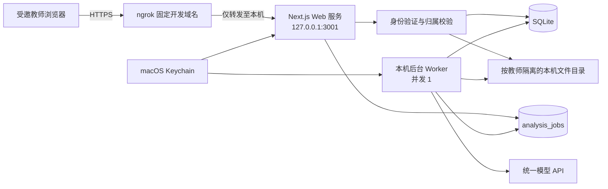

# AI 作文批改助手私密分享内测版设计

## 1. 背景

现有应用是一套只监听 `127.0.0.1` 的 macOS 本机单用户工具。作文图片、批改报告和 PDF 保存在本机 `.data/` 目录，业务数据使用 SQLite，模型 API Key 保存在 macOS Keychain。该形态适合所有操作都由同一位教师在同一台 Mac 上完成，不适合直接暴露到公网。

本次改造面向最多 2 位受邀教师。教师会上传真实学生作文，因此分享地址必须有身份验证、教师间数据隔离、密码防护和到期删除能力。系统仍运行在当前 Mac 上，不购买域名、云服务器或数据库服务。

## 2. 已确认决策

- 使用无自有域名的 ngrok 固定开发域名提供公网 HTTPS 地址。
- 创建 `teacher01`、`teacher02` 两个独立教师账号，每个账号使用独立密码。
- 保留一个管理员账号，用于当前所有者使用应用及管理平台模型设置。
- 不开放注册、短信验证码、微信登录、找回密码或网页账号管理后台。
- 平台统一配置模型 API Key，教师无需填写或接触密钥。
- 每位教师只能访问自己创建的作文、批注、报告、图片和 PDF。
- 作文数据从首次上传起保留 30 天，到期自动永久删除；教师可提前删除。
- AI 分析改为后台任务，全局同时只处理 1 篇作文。
- Mac 必须保持开机、联网且不休眠；Mac 离线时分享网页不可用。

## 3. 目标与非目标

### 3.1 目标

- 让 1–2 位指定教师通过普通浏览器和 HTTPS 地址使用现有批改功能。
- 即使公网地址被转发，未登录访问者也不能读取任何业务数据。
- 教师之间形成完整的服务端数据隔离，不能通过修改 URL 或请求参数越权。
- 页面刷新、网络短暂中断或浏览器关闭不影响正在进行的 AI 分析。
- 管理员可在本机创建、停用和重置教师账号，无需维护管理后台。
- 在保留现有作文批改、人工复核和 PDF 导出能力的同时，尽量减少基础设施改造。

### 3.2 非目标

- 不提供公开注册、付费、套餐、短信、微信登录或学校组织空间。
- 不保证 7×24 小时可用性，不提供服务等级协议（SLA）。
- 不迁移至 PostgreSQL，不引入 Redis 或外部任务队列。
- 不支持超过 2 位教师的规模化并发使用。
- 不把作文、数据库或 PDF 主动同步到云存储。
- 不将本次技术设计表述为完整的法律合规意见。

## 4. 总体架构



Next.js Web 服务只监听回环地址，不能从局域网或公网直接连接。ngrok 是唯一的公网入口。Web 服务负责登录、业务 API、图片上传、人工复核和 PDF 下载；独立 Worker 负责耗时 AI 分析。二者共享同一 SQLite 数据库和本机文件目录。

ngrok、Web 服务和 Worker 分别由 macOS `launchd` 托管，在用户登录后启动，异常退出后自动重启。应用不依赖当前 Codex 调试会话存活。

## 5. 身份验证与账号管理

### 5.1 账号模型

新增 `users` 表，至少包含以下字段：

- `id`：内部不可预测 ID。
- `username`：唯一登录名，规范化后比较。
- `passwordHash`：Argon2id 密码哈希。
- `role`：`admin` 或 `teacher`。
- `mustChangePassword`：是否必须在首次登录后修改密码。
- `disabledAt`：账号停用时间。
- `createdAt`、`updatedAt`：审计时间。

系统初始化时创建 1 个管理员账号；教师账号通过本机 CLI 创建。CLI 使用隐藏输入读取密码，密码不得出现在命令参数、Shell 历史、应用日志或数据库明文字段中。管理员可以让 CLI 生成一次性随机初始密码，并只在当前终端显示一次。

### 5.2 登录和会话

- 教师输入用户名和密码登录，首次登录必须修改初始密码。
- 会话令牌使用密码学安全随机数生成，数据库只保存令牌哈希。
- Cookie 设置 `HttpOnly`、`Secure`、`SameSite=Strict`，生产环境不允许 JavaScript 读取。
- 会话闲置 12 小时后失效；修改密码、停用账号或管理员执行「注销全部会话」后立即失效。
- 登录成功后轮换会话令牌，退出登录后删除对应会话记录。
- 所有写接口检查 `Origin`，并使用同源 Cookie 与 CSRF 防护，拒绝跨站提交。

### 5.3 密码防猜测

新增 `login_attempts` 或等价限速记录：

- 同一账号连续失败 5 次后锁定 15 分钟。
- 同一来源 IP 同时实施限速，防止轮换用户名尝试。
- 登录失败统一显示「用户名或密码错误」，不暴露账号是否存在。
- 登录、锁定、密码修改、账号停用和会话撤销写入不含密码的安全事件日志。

## 6. 授权与教师数据隔离

### 6.1 数据归属

`reviews` 增加非空 `ownerId`，关联 `users.id`。现有历史记录在迁移时全部归属于管理员账号。教师创建作文时，`ownerId` 只能取当前会话用户，客户端不能提交或修改该字段。

所有服务层和仓储层操作同时使用 `reviewId + ownerId` 查询。以下接口都必须执行归属校验：

- 批改记录列表、详情、更新和删除。
- 图片上传、排序、旋转、裁剪、替换和读取。
- AI 分析创建、状态查询和重新分析。
- 批注与报告保存。
- PDF 生成、下载和重新导出。

仅验证「记录 ID 存在」不满足要求。找不到记录与无权访问统一返回 `404`，避免泄露其他教师是否创建了该记录。

管理员没有默认读取其他教师作文的后门。管理员角色只增加模型设置和本机运维能力，管理员自己的历史记录仍以普通归属规则处理。

### 6.2 文件隔离

文件路径调整为：

```text
.data/users/<ownerId>/reviews/<reviewId>/
```

文件服务根据数据库中的归属关系解析路径，不接受客户端提供的文件路径。继续执行现有的路径边界、符号链接拒绝和原子写入保护。下载文件名来自服务器生成或经过清理的元数据，不直接信任上传文件名。

## 7. AI 后台任务

### 7.1 任务模型

新增 `analysis_jobs` 表，包含：

- `id`、`reviewId`、`ownerId`。
- `status`：`queued | running | succeeded | failed | canceled`。
- `attempt`、`availableAt`、`leaseExpiresAt`。
- `progressStage`：`queued | reading_images | generating_review | validating_result | saving_result`。
- `errorCode`、面向教师的安全错误信息。
- `createdAt`、`startedAt`、`finishedAt`。

同一篇作文同一时刻只允许存在 1 个未结束任务。重复点击通过唯一约束和幂等键返回已有任务，不重复消耗模型费用。

### 7.2 处理流程

1. 教师点击「开始 AI 分析」。
2. Web 服务验证作文归属、图片数量和版本后创建任务，并立即返回 `202`。
3. Worker 从 SQLite 领取最早的可执行任务，全局并发固定为 1。
4. Worker 设置租约并定期续租，调用现有模型适配器完成识别、评分、批注和结构校验。
5. 结果与任务状态在同一业务提交中落库；页面轮询任务和作文状态。
6. 浏览器关闭、刷新或 ngrok 短暂断线不会取消任务。

Worker 异常退出后，超过租约时间的 `running` 任务重新进入队列。模型请求沿用 180 秒超时和针对 `429`、`5xx` 的单次重试，但任务总尝试次数有明确上限，避免无限消费。结构修复失败、图片不可辨认和外部模型失败分别保留现有业务状态与明确提示。

## 8. 数据保留和删除

每篇作文首次成功上传图片时写入不可自动延长的 `expiresAt = 首次上传时间 + 30 天`。人工复核、重新分析或重新导出 PDF 不延长到期时间，页面显示剩余保留天数。没有成功上传图片的空草稿在创建 24 小时后自动删除。

清理任务在应用启动时执行一次，此后每天执行一次：

1. 将到期记录标记为 `deleting`，阻止继续读取或修改。
2. 删除该作文的原图、AI 副本、批注图、PDF 和临时文件。
3. 删除批注、任务、图片元数据和作文记录。
4. 若中途失败，下次清理从 `deleting` 状态继续，直到数据库和文件系统均无残留。

教师手动永久删除复用同一流程，并要求二次确认。删除完成后不可恢复。

`.data/` 不进入 Git、云盘同步或普通 Time Machine 备份，避免到期删除后仍在其他副本中长期保留。该选择意味着 Mac 磁盘损坏时作文数据可能丢失；内测阶段接受此权衡。Mac 应启用 FileVault，并使用独立、强度足够的系统登录密码。

## 9. ngrok 公网入口

### 9.1 入口配置

- 使用 ngrok 免费账号自动分配的固定开发域名。
- ngrok 仅转发至 `http://127.0.0.1:3001`。
- 公网地址始终使用 ngrok 提供的 HTTPS，不开放本机路由器端口。
- ngrok Agent 凭据不写入仓库、数据库或日志，配置文件权限限制为当前 macOS 用户可读。
- 本机 ngrok inspection 数据库关闭；ngrok 账号不得开启 Full Capture。
- 应用日志不得记录 Cookie、Authorization、API Key、作文图片内容或请求体。

ngrok 免费版的固定开发域名、每月 1 GB 数据传输、20,000 次 HTTP 请求和首次浏览器提示页属于已接受的内测限制。达到额度后应用会暂时无法通过公网地址访问，管理员可等待额度刷新或主动升级 ngrok 套餐。

### 9.2 公开与受保护路径

仅以下内容允许未登录访问：

- 登录页面和登录接口。
- 登录页所需的静态资源。
- 只返回存活状态、不包含版本、路径或配置的健康检查。

其他页面、API、图片和 PDF 均要求有效会话。设置页面和设置 API 额外要求 `admin` 角色。robots 指令禁止搜索引擎索引，但其只作为辅助措施，不能替代身份验证。

## 10. 隐私提示与模型数据边界

上传前展示简短且必须确认的提示：

- 教师确认有权上传并处理该作文。
- 教师应尽量遮盖与批改无关的姓名、学校、班级和联系方式。
- 作文图片会发送给管理员配置的第三方 AI 服务进行分析。
- 本机系统默认保存 30 天，教师可提前永久删除。
- 删除本机数据不等于删除第三方 AI 服务已经处理或保留的数据。

应用不新增学生姓名、学号、学校或班级字段。教师账号和作文归属用于访问控制，不用于建立学生档案。

## 11. 教师体验

教师访问固定 ngrok 地址后按以下流程使用：

1. 首次看到 ngrok 免费版提示页时点击继续。
2. 输入个人用户名和密码。
3. 首次登录修改初始密码。
4. 确认隐私提示并上传 1–3 张作文图片。
5. 创建 AI 分析任务；页面显示排队与处理阶段。
6. 离开页面后可再次登录查看结果。
7. 完成人工复核，保存并下载 PDF。
8. 提前永久删除作文或等待 30 天自动删除。
9. 使用完毕后退出登录。

首页只展示当前教师的记录和统计。模型设置入口对教师隐藏。错误提示使用可执行语言，例如「本机服务暂时离线，请联系管理员」或「模型服务响应超时，可以重新分析」，不显示内部堆栈、数据库错误或上游响应原文。

## 12. 本机运维

项目提供不回显密钥的本机 CLI：

- 创建管理员或教师账号。
- 列出账号的用户名、角色和启停状态。
- 重置初始密码并撤销全部现有会话。
- 停用或恢复账号。
- 手动触发到期数据清理。
- 查看 Web、Worker 和 ngrok 的健康状态。
- 启动、停止或重启全部后台服务。

管理员停用某位教师后，教师现有会话立即失效，后续登录被拒绝。若需暂停全部分享，停止 ngrok 服务即可；本机 `127.0.0.1` 访问仍可保留。

`launchd` 管理 3 个相互独立的服务：

- `ai-composition-grader-web`：生产模式 Next.js。
- `ai-composition-grader-worker`：AI 后台任务 Worker。
- `ai-composition-grader-tunnel`：ngrok Agent。

每个服务使用固定工作目录、最小环境变量和受限日志。部署或升级时先停止领取新任务，等待当前任务结束，再重启 Web 和 Worker，避免生成半成品报告。

## 13. 错误处理

- **Mac 关机、休眠或断网：** 公网访问失败；恢复联网和唤醒后由 `launchd` 重启服务。
- **ngrok 掉线：** 本机应用继续运行；ngrok 重连后使用同一开发域名恢复访问。
- **免费额度耗尽：** 登录页无法到达；管理员通过 ngrok 控制台确认额度，不在应用内猜测原因。
- **登录暴力尝试：** 账号和来源 IP 限速，记录安全事件，不记录密码。
- **浏览器在分析中关闭：** 后台任务继续，教师重新登录后查看状态。
- **Worker 崩溃：** 租约到期后重新领取；达到最大尝试次数后进入 `failed`。
- **模型返回无效内容：** 沿用一次结构修复；仍失败则保留失败状态和可重试入口。
- **图片不可辨认：** 进入「需要重新拍照」，不生成猜测性分数。
- **到期清理部分失败：** 保持 `deleting`，禁止业务访问，下次清理继续。
- **PDF 生成失败：** 作文和报告保持可用，允许教师重新导出。

## 14. 测试策略

### 14.1 单元测试

- 密码哈希、首次改密、会话过期和令牌轮换。
- 5 次失败锁定 15 分钟及来源 IP 限速。
- 普通教师无法访问管理员设置。
- 30 天到期计算不可由编辑操作延长。
- 任务幂等、租约回收、最大重试和并发 1。

### 14.2 集成测试

- 两个教师创建同名作文时数据仍完全隔离。
- 使用另一教师的 `reviewId`、`imageId`、任务 ID 或 PDF 地址统一返回 `404`。
- 停用账号立即撤销现有会话。
- 手动删除和自动清理同时删除数据库记录及文件目录。
- Worker 重启后恢复未完成任务，不重复保存报告或重复计费。
- API 设置与 Keychain 仅管理员可用，响应不回显密钥。

### 14.3 端到端测试

- 首次登录并强制改密。
- 教师 A 上传、分析、刷新、复核和下载 PDF。
- 教师 B 无法看到教师 A 的列表、图片、批注和 PDF。
- 分析期间关闭浏览器，再次登录后任务继续并显示结果。
- 错误密码锁定、退出登录和会话到期。
- 通过 ngrok HTTPS 地址完成真实浏览器 smoke 测试，不在测试日志中保存作文内容。

## 15. 验收标准

- 受邀教师可通过固定 HTTPS 地址登录并完成上传、AI 分析、复核和 PDF 下载。
- 未登录访问所有业务页面、API、图片和 PDF 均被拒绝。
- 教师间越权测试全部失败，且不会泄露资源是否存在。
- 页面刷新和公网短暂断线不会中断后台分析。
- 管理员可在本机完成账号创建、重置、停用和服务启停。
- 30 天自动清理和手动永久删除均能清除数据库与文件。
- Web、Worker 和 ngrok 在 Mac 登录后自动启动，异常退出后由 `launchd` 恢复。
- 完整单元测试、集成测试、端到端测试、代码检查和生产构建通过。

## 16. 已知限制和升级触发条件

该方案是面向 1–2 位指定教师的私密内测，不是正式公网 SaaS。以下任一情况出现时，应停止继续扩展本机方案并迁移到国内云端架构：

- 教师人数超过 2 位。
- 需要稳定的 7×24 小时服务。
- ngrok 免费流量持续不足。
- 需要学校组织、付费、短信或微信登录。
- 需要集中审计、云备份、容灾或正式服务承诺。
- 需要处理更多未成年人身份信息或与学校系统连接。

## 17. 参考资料

- [ngrok 免费套餐限制](https://ngrok.com/docs/pricing-limits/free-plan-limits)
- [ngrok Traffic Inspector](https://ngrok.com/docs/obs/traffic-inspection)
- [ngrok Agent 配置](https://ngrok.com/docs/agent/config/v2)
- [Next.js 部署方式](https://nextjs.org/docs/app/getting-started/deploying)
- [Next.js 自托管](https://nextjs.org/docs/app/guides/self-hosting)
- [中华人民共和国个人信息保护法](https://www.cac.gov.cn/2021-08/20/c_1631050028355286.htm)
- [未成年人网络保护条例](https://www.cac.gov.cn/2023-10/24/c_1699806932316206.htm)
